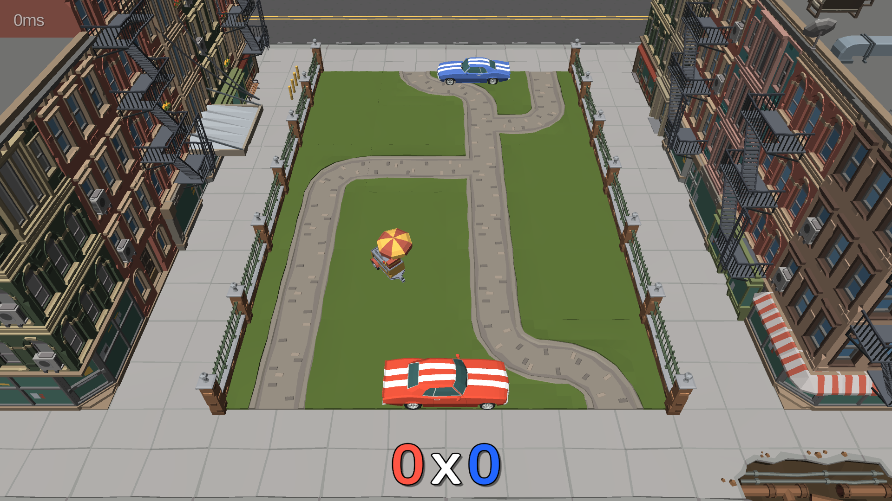
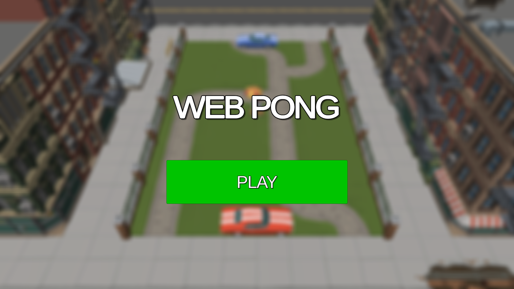
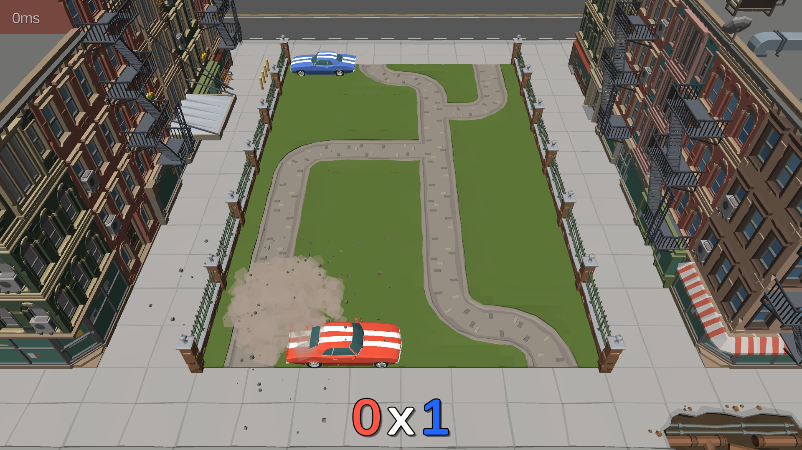
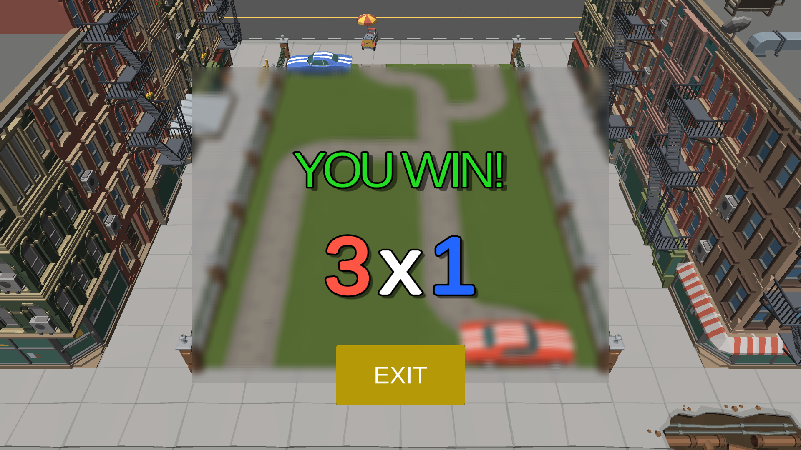
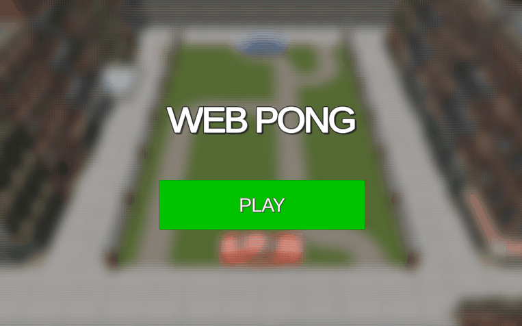
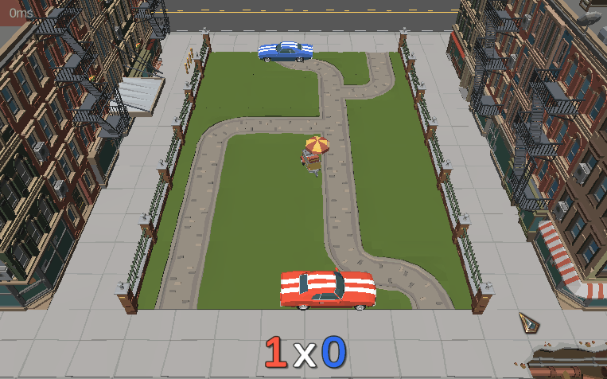

#  Web Pong









## About the project

Web Pong is a multiplayer Pong game with a Unity WebGL support focus




The connection is made with WebSocket to a [NodeJs Server](https://github.com/joveem/Web-Pong-Back-End) that manage the Matchmaking, and handles the game Matches

---

### Getting Started:

##### Cloning the repository:

To open the project in development mode, you need to have an environment configured with [Unity 3D](https://unity3d.com/pt/get-unity/download/archive) (preferably: version ^2020.3.23) and add the [JovDK](https://github.com/joveem/JovDK) module as a git submodule of the project

``` sh
# Clone the repository:
git clone https://github.com/joveem/Web-Pong.git
# Directory changing
cd Web-Pong
# Install dependencies:
git submodule update --recursive --init
#
```
